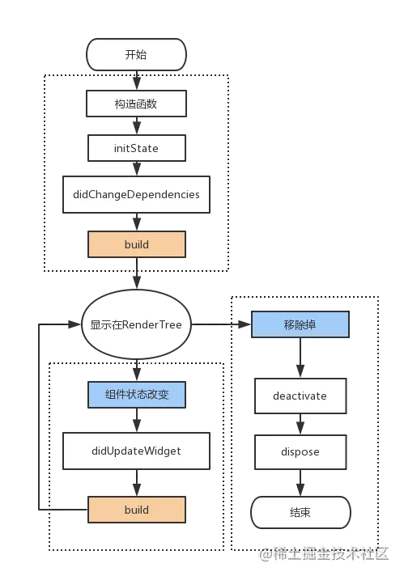
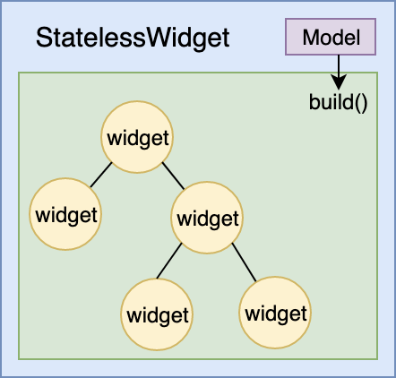
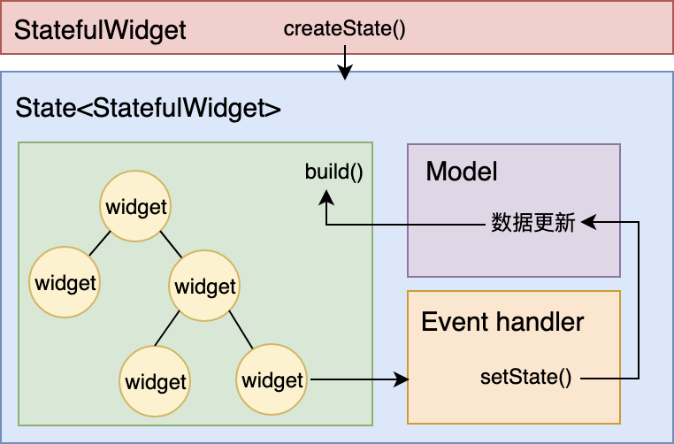
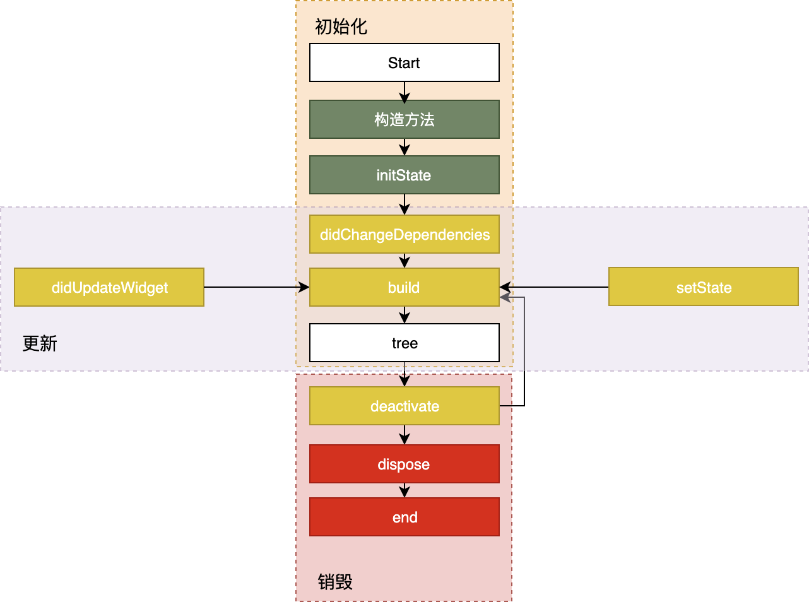
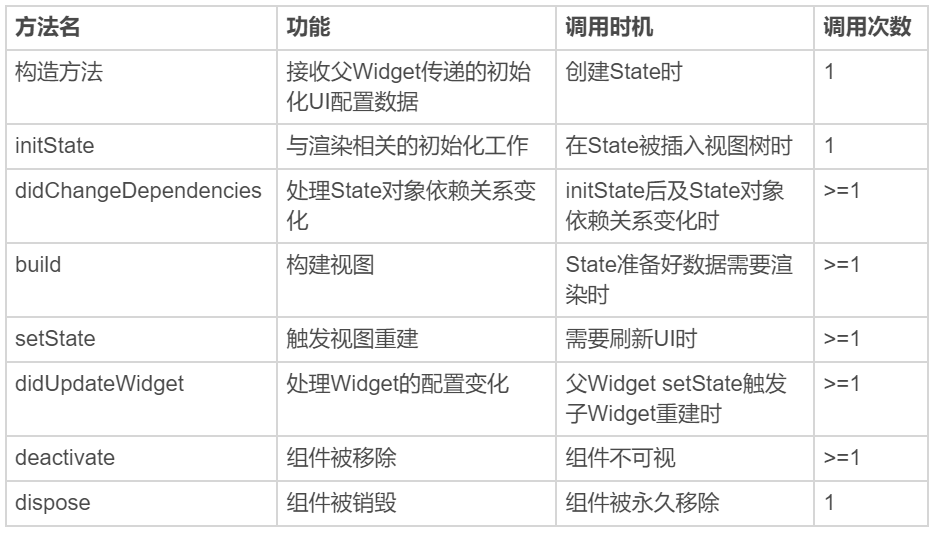
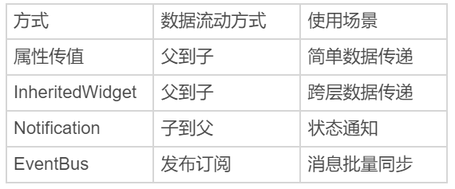
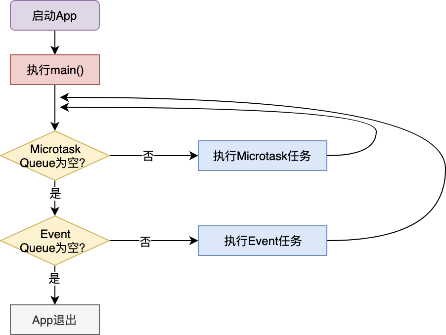
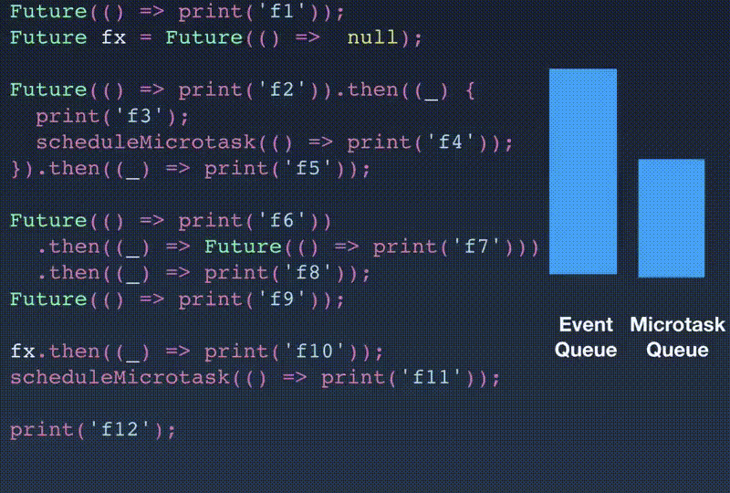

## widget

采用了现代响应式框架构建，中心思想是用widget来构建UI。widget描述了他们的视图在给定其当前配置和状态时应该看起来像什么。当widget的状态发生变化时，widget会重新构建UI，flutter会对比前后变化的不同，类似vDom，以确定底层渲染树从一个状态转化到下一个状态所需要的最小更改。 

### 状态

widget可以是有状态或者无状态的，类似react，无状态是StatelessWidget，有状态是StatefulWidget。widget主要工作是实现一个build函数，用以构建自身。一个widget通常由一些较低级别widget组成。flutter框架将依次构建这些widget，直到构建最底层的子widget时，这些最底层的widget通常为renderObject，它会计算并描述widget的几何状态。

- statefulWidget和State是单独的对象。在flutter中，这两个类型的对象具有不同的生命周期；widget是临时对象，用于构建当前状态下的应用程序，而State对象在多次调用build()之间保持不变，允许他们记住状态
- flutter中，事件流是向上传递，状态流是向下传递，类似react 子传父是通过事件通信，父传子是通过状态。

### 基础widget

- Text：该widget可让创建一个带格式的文本
- Row，Column：这些具有弹性空间的布局类Widget可在水平和垂直方向创建灵活的布局。其设计是基于web开发中的flebox布局模型
- stack：取代线性布局，允许子widget堆叠可以使用Positioned来定位他们相对于上下左右四条边的位置。Stacks是基于web开发中的绝对定位布局模型设计的。
- Container：可以创建矩形视觉元素。container可以装饰一个BoxDecoration，比如background，一个边框或者一个阴影。container可以具有margins padding和应用于其大小的约束。另外container可以使用矩阵在三维空间中对其进行变换。

### Flutter优势

- Skia引擎，chrome chrome OS Android firefox Firefox OS都用此作为渲染引擎
- Dart语言可以AOT编译成ARM Code，让布局以及业务代码运行的更快，而且Dart的GC指针对Flutter频繁销毁创建Widget做了专门的优化
- CSS的子集 flex的布局方式，保留了强大表现能力的同时 也保留了性能
- Flutter业务书写的Widget在渲染之前diff转换成render object，就像react的vdom，以此来保证开发体验和性能

相比于rn

- RN使用了js来运行业务代码，然后js brige的方式调用平台相关组件，性能比有损失，甚至平台不同js引擎都不一样
- rn使用平台组件，行为一致性会有打折。

fluuter相比于js而言，还是比较像的，单线程，event loop等 而相比于js更友好的是，强类型，不再需要去增加新的认知（TS），不会失控的this，更加强大的操作符号。

fluuter是单线程事件驱动，但是也开放了多线程，可以充分利用多核CPU，相比js的web worker/serve worker能做的事件更多。

### flutter生命周期



可以看到一个有状态的组件需要两个class，这样写的原因在于，flutter中的widget都是immmutable（不可变性）的，状态组件的状态保存在state中，组件任然会每次重新创建，widget在这里只是一个对组件的描述，flutter会diff转换成element，然后转换成renderobj才进行渲染。

### State Management

flutter中状态跟react同样都是从上往下流转的，因此也会存在嵌套过深的时候，状态不容易管理，所以flutter也有类似react的context的东西，就是inheritedWidget。

### 创建路由

_createRoute返回一个pageRouteBuilder接受两个参数，**pageBuilder，transitionBuilder**。第一个返回新路由显示的组件，第二个return的child就是第一个参数返回的组件。pageBuilder方法仅会在第一次构建路由的时候被调用。框架能够自动避免做额外的工作，因为整个过渡期间child保存了同一个实例。

### Form

Form有唯一的key，可以使用GlobalKey作为唯一标识，类似web框架中form组件的ref。

### Input

input的方法 fouce和value可以通过onChange方法获取，也可以通过controller来绑定TextEditingController，但是要注意在生命周期进行绑定和销毁。包括input的fouce方法也是通过绑定fouceNode来调用，随后就可以通过绑定的对象进行相应的调用。

## 布局

- Widget会通过它的父级获取自身的约束。约束实际上就是4个浮动类型的集合，最大/最小宽度 和最大 最小高度
- 然后，这个widget将会逐个遍历它的children列表。向子级传递约束（子级之间的约束可能会有所不同），然后询问它的每一个子级需要用于布局的大小。
- 这个widget就会对它的子级的children逐个进行布局。（水平以及竖直）
- 最后 widget将会把它的大小信息向上传递至父widget（包括原始的约束条件）

布局限制

- 一个widget仅在其父级给的约束的情况下才能决定自身的大小。这意味着widget通常情况下不能随意获得其想要的大小
- 一个widget无法知道，也不需要知道其在屏幕中的位置，因为它的位置是由其父级决定的。
- 当轮到父级决定其大小和位置的时候，同样的也取决于它自身的父级。所以，在不考虑整个树的情况下，几乎不可能精确定义任何widget的大小和位置。
- 如果子级想要拥有和父级不同的大小，然而父级没有足够的空间对其进行布局的，子级设置的大小可能会不生效。这时请明确它的对齐方式。

## 架构

### embedder

嵌入器，这是和底层的操作系统进行交互的部分。因为flutter最终要将程序打包到对应的平台中，所以这个嵌入器需要和底层的平台进行交互。叫嵌入器因为可以作为整个应用程序，也可以作为现有程序的一部分被嵌入使用。

### engine

engine是flutter核心部分。基本上都是C++写的。engine的存在是为了支持Dart Framework的运行。它提供了flutter的核心API，包括作图，文件操作，网络IO，dart运行时环境等核心功能。engine主要是通过dart:ui暴露给flutter framework层

### flutter framework

这一层是用户编程的接口，我们的应用程序需要和flutter framework进行交互，最终构建出一个应用程序。主要是用使用dart语言编写的。

framework从下到上，最基础的foundational包，和构建在其上的animation,painting和gestures。再网上就是rendering层，rendering为我们提供了动态创建可渲染对橡树的方法，通过这些方法，我们可以对布局进行处理。接着就是widgets layer，是rendering层中对象的组合，表示一个小组件。最后是Material和cupertino库，这些库使用widgets层中小组件，组成不同风格的控件

---

---

---

### widget渲染过程

通常情况下，不同的UI框架中会以不同的方式去处理这一问题，但无一例外都会用到视图树的概念。而flutter将视图树的概念进行了扩展，把视图数据的组织和渲染抽象为三部分，widget，element和renderObject。


### widget

是一种对视图的结构式描述，可以看作前端中的控件或者组件，widget是控件实现的基本逻辑单位，里面存储的是有关视图渲染的配置信息，包括布局，渲染属性，事件响应信息等。

在页面渲染上，flutter将simple is best做到了极致。flutter将widget设计成不可变的，所以当视图渲染的配置信息发生变化时，flutter会选择重新构建widget树的方式进行数据更新，以数据驱动UI构建的方式简单高效。

因为设计到不停的销毁以及构建widget，所以会垃圾回收造成了压力，不过widget本身并不设计实际渲染位图，所以它只是一份轻量级的数据结构，重建成本很低。

另外，由于widget的不可变性，可以以较低成本进行渲染节点复用，因此在一个真实的渲染树中可能存在不同的widget对应同一个渲染节点的情况，无疑又降低了重建UI的成本。

### Element

Element是widget的一个实例化对象，它继承了视图构建的上下文数据，连接结构化的配置信息到完成最终渲染的桥梁。

flutter渲染过程，可以分为三步：

- 通过widget树生成对应的element树
- 创建对应的renderObject并且关联到element.renderObject属性上。
- 最后，构建程renderObject树，完成最终的渲染。

可以看到element同时持有widget和renderObject。而无论是widget还是element，都不负责最后渲染，只负责传递信号。真正去渲染的是renderObject。如果没有element树的话，直接widget命令renderObject去渲染的的话会造成极大的渲染成本。

因为Widget是不可变的，而element是可变的。实际上element树将Widget树的变化做了一层抽象，类似react的vdom，可以只将真正需要修改的部分同步到真实的renderObject树中，最大程度降低了对真实渲染视图的修改，提高渲染效率，而不是销毁整个渲染视图重建。

### RenderObject

主要是负责视图渲染的对象。flutter通过widget树中的每个Widget创建不同类型的渲染对象，组成渲染对象树。

而渲染对橡树在flutter的展示过程分为四个阶段，布局，绘制，合成和渲染。其中，布局和绘制在renderObject中完成，flutter采用深度遍历优先渲染对橡树，确定树中各个对象的位置和尺寸，而把它们绘制到不同的涂层上。绘制完成后，合成和渲染工作交给Skia

flutter通过引用Widget，element和renderObject这三个概念，把原本从视图数据到视图渲染构建过程拆分的更简单，直接，在易于集中治理的同时，保持了较高的渲染效率。

### UI编程范式

flutter的视图开发是声明式的，其核心设计思路就是将视图和数据分离，这是跟react的设计思路是完全一致的。

### StatelessWidget

在flutter中，widget采用由父到子，自上乡下的方式进行构建，父Widget控制者子Widget的显示样式，其样式配置由父Widget在构建时提供。

用这种方式构建出的Widget，有些创建（Text,Container,Row,Column等）在创建时，除了这些配置参数之外不以来于任何其他的信息，换句话说，一旦创建成功就不再关心，也不响应任何数据变化进行重绘。这样的组件被称为StatelessWidget（无状态组件）



### StatefulWidget

有一些Widget 比如Image checkbox的展示 除了父WIdget初始化传入的静态配置之外，还需要处理用户的交互，或者其内部数据的变化，并且展现在UI上。这些Widget创建完成后，还需要关心和响应数据变化来进行重绘。这类组件就是statefulWidget。



eg:其实这边就是跟react的模式是一样的，纯UI展示组件就是只受props控制，而没有自己的state，这种就是statelessWidget，而大多树react组件都是有自己的state，通常都是进过更粒度的拆分，一个不受控组件拆分为若干个受控组件和不受控组件compose起来的。

### State生命周期

state的生命周期 指的是在用户参与的情况下，其关联的Widget所经历的，从创建到显示再到更新到卸载的各个过程的阶段。

这些不同的阶段涉及到特定的任务处理



### 创建

- 构造方式是state的生命周期的起点，flutter会通过调用statefulWidget.createState()来创建一个state。我们可以通过构造放啊，来接受父Widget传递的初始化UI配置数据。这些配置数据决定了WIdget最初的呈现效果
- initState,会在state对象被插入视图树的时候调用。这个函数在state的生命周期中只会被调用一次，所以我们可以在这边做一些初始化工作。比如状态变量设定默认值
- didChangeDependencies则是专门用来处理state对象依赖变化，会在initState()调用结束后，被flutter调用
- build，作用是构建视图，经过上面步骤，framework认为state已经准备好了，于是调用build。我们需要在这个函数中，根据父Widget传递过来的初始值配置数据，以及state当前的状态，创建一个widget然后返回

### 更新

Widget状态更新，主要是三个方法触发setState → didChangeDenpendencies→didUpdateWidget

一旦这三个放啊被调用，flutter随后就会销毁老的widget，并且调用build方法重建widget。

### 销毁

组件销毁比较简单，比如组件移除，或者页面销毁的时候，就会调用deactivate和dispose这两个方法，来移除或者销毁组件。



## 布局

跟web一样 分为垂直方向和水平方向。row和clumn，两个widget都可以去设置子widget的排列方式，类似于css flex 可以设置对齐方式，mainAxisAlignment属性接受的参数和web中的justity-centent一样。表现也都是一样的。

面对一些复杂的UI，flutter提供的单一功能控件往往不能直接满足我们的需求，我们需要自定义widget。flutter提供了组装和自绘两种自定义的Widget的方式，来满足我们对视图的自定义需求。

以组装的方式构建UI，我们需要将目标图分解成若干个UI小元素。通常我们可以按照从上倒下，从左到右的布局顺序去对控件层次结构进行拆解，将基本视觉元素封装到Cloum,row中。对于有固定间距的视觉元素，我们可以通过padding对其进行包装，而对于大小伸缩可变的视觉元素，可以通过expended控件让其填充父容器的空白区域。

而以自绘的方式定义控件，则需要借助于customPaint容器，以及承接绘制逻辑的customPainter,customPainter是绘制逻辑的封装，在其paint方式中，我们可以使用不同类型的画笔paint，利用画笔canvas提供的不同类型的绘制徒刑能力，实现控件自定义绘制。

无论是组合还是自绘制，在自定义UI时候，有了目标视图整体印象后，我们首先需要考虑事件就是如果一步一步拆解，变成自己可以直接着手实现的一个个小控件，然后再思考怎么把这些控件串联起来。组成最终的视觉效果的页面。

### 交互

手势操作在flutter分两种：

- 第一种是原始的指针事件，即原生开发中常见的触摸事件，表示屏幕上触摸行为触发的位移行为；
- 第二种是手势识别，表示多个原始指针事件的组合操作，如点击，双击，长按等，是指针事件的语义化封装。

指针事件

比如手指接触屏幕pointerDownEvent，手指在屏幕上移动pointerMoveEvent，手指抬起PointerUpEvent，以及触摸取消PointerCancelEvent，这与原生系统的底层触摸事件抽象是一致的。

在手指接触屏幕，接触事件发起时，flutter会制定手指与屏幕发生接触的位置究竟有哪些组件，并将接触事件交给最内层的组件响应，与浏览器中的事件冒泡机制类似，事件会从这个最内层的组件开始，沿着组件树向根结点向上冒泡分发。不过flutter没法像浏览器冒泡那样取消或者停止事件的进一步分发，我们只能通过hitTestBehavior去调整组件在命中测试期内应该如果表现，比如把触摸事件交给子组件，或者交给其视图层级之下的组件去响应。

关于组件层面的原始指针事件的监听，flutter提供了listener Widget，可以监听其子Widget的原始指针事件。提供了gesture 以及gestureDetector来监听用户的手势操作

### 数据跨层级传输

InheritedWidget

作为中间层 利用context进行传输，通常用于父级别元素向下传递到底层元素，底层元素拿到state或者修改state的方法，inheritedWIdget接受需要传递的state的引用以及方法的引用，作为包裹层，然后在子元素中利用widget.of拿到state 就可以拿到父元素的state或者方法的引用。原理跟子元素拿到主题色一样，theme.of(context).textColor。

notification

notification跟inheritedWidget恰恰相反，后者是父级元素向下传递或者说数据共享的方法，而notification则是子元素向上共享数据的方法。这样的数据传输适用于子widget状态变更，发送通知到上级。

eventbus

上面两种数据共享方法都是依赖于Widget 也就是必须要有父子关系的，但是如果共享的数据不存在Widget中的话就需要使用eventbus了。

eventbus是flutter中跨组件通信的机制。它遵循发布/订阅模式，允许订阅者订阅时间，当发布者触发事件的时候，就可以通过事件进行通信。

几种不同的通信方式对比



### 路由管理

在flutter中，页面之间的跳转是通过Route和Navigator来管理的；

- Route是页面的抽象，主要是负责创建对应的界面，接受参数，响应Navigator打开和关闭
- 而Navigation则会维护一个路由栈管理Route，Route打开即入栈，关闭即出栈，还可以直接替换栈内的某一个Route。这一点类似h5的history router。

而根据是否需要提前注册页面表示符，flutter中的路由管理可以分为两种方式

- 基本路由。无需提前注册，在页面切换的时候需要自己构造页面实例。
- 命名路由。需要提前注册页面标识符，在页面切换时候通过标识符可以直接打开新的路由。

路由参数

flutter提供了路由参数的功能，可以在routeSetting来获取参数，通过arguments来传递参数。

```jsx
//打开页面时候传递字符串参数
Navigator.of(context).pushNamed('sencond_page',arguments:"hey");

class SencondPage extends StatelessWidget{
	@override
	Widget build(BuildContext context){
		//取出路由参数
		String msg = ModalRoute.of(context).setting.arguments as String
		return Text(msg)
	}
}
```

类似react-router flutter也有跳转到一个不存在路由的缺省页面机制，onUnknownRoute

```jsx
MaterialApp(
	...
	routes:{
		'xxx':(context)=>App()
	},
	onUnKnownRoute:(RouteSettings setting)=> MaterialPageRoute(build:(context)=> UnknowPage())
)
```

flutter提供了基本路由和命名路由两种方式，来管理页面间的跳转。其中，基本路由需要自己手动创建页面实例，通过Navigator.push完成页面跳转；而命名路由需要提前注册标识符创建方法，通过Navigator.pushNamed传入标识符实现页面跳转。

```jsx
class myComponent extends statelessWidget{
	@override
	Widget build(BuildContext context){
		return(
			Socaffld(
				...
			)	
		)
	}
}
```

### 动画效果

动画就是静态的画面根据事先定义好的规律，在一定时间内不断微调，产生变化效果。而动画实现由静态到动态，主要是靠人眼的视觉残留效应。所以对动画系统而言，为了实现动画，需要做三件事。

1. 根据画面变化的规律
2. 根据这个规则，设定动画周期，启动动画。
3. 定期根据当前动画的值，不断的微调，重绘画面。

这三件事对应在flutter中，就是Animation ,AnimationController,Listener

1.Animation是flutter动画库中的核心类，会根据预定规则，在单位时间内持续输出动画的当前状态。Animation知道当前动画的状态，比如是否开始，停止，前进或者后退，以及动画的当前值。但是却不知道这些状态应该用在哪个组件上面。Animation仅仅是用来提供动画数据，而不负责动画的渲染。

1. AnimationController用于管理Animation，可以用来设置动画的时长，启动动画，暂停动画，反转动画等。
2. Listener是Animation的回调函数，用来监听动画的进度变化，我们需要在这个回调函数中，根据动画的当前值重新渲染组件，实现动画的渲染。

### 关于flutter线程

首先知道的是Dart是单线程模式的语言，和js一样。但是由于JS支持异步，所以nodejs在异步I/O方面的效率很高，比如用户点击，网络返回，等待I/O结果。而这些行为不是阻塞的。比如，网络请求，socket本身提供了select模型可以异步查询，而文件I/O，操作也提供了基于事件的回调机制。

基于这些特点，单线程模型可以在等待的过程中处理别的事情，等真正需要响应结果了，再去做响应的处理，因为等待的过程是非阻塞的，所以给我们的感觉是在做很多事情一样，但是始终只有一个线程在处理事件。而JS都熟悉，它的eventloop模型的设计决定了它是如果完成异步行为的。同样dart也是通过eventloop来驱动的。

在dart中实际上有两个队列，一个是事件队列 ，一个是微任务队列，在每次事件循环中，dart总是先去第一个微任务队列中查询是否有可执行的任务，如果没有，才会处理后续的事件队列的流程，



微任务队列：在一个短时间内就能够完成的异步任务，微任务在事件循环中优先级是最高的，只要队列中还有任务，就可以一只霸占这事件循环。而dart微任务是由scheduleMicroTask建立的。但是这个用的比较少。

异步任务用的最多的还是优先级耕地的event queue。比如i/o，绘制，定时器这些异步事件，这些是通过事件队列驱动主线程执行的。而dart给事件队列起了个名字是feature.

```jsx
Future(()=>print('running in future 1'));

Future(()=>print('1'))
	.then((_)=>print('and then 2'))
	.then((_)=>print('and then 3')) //上一个事件循环结束后，连续输出三段字符
```

```jsx
//f1比f2先执行
Future(() => print('f1'));
Future(() => print('f2'));

//f3执行后会立刻同步执行then 3
Future(() => print('f3')).then((_) => print('then 3'));

//then 4会加入微任务队列，尽快执行
Future(() => null).then((_) => print('then 4'));
```



then会在feature函数执行完毕之后立即执行，无论是公用同一个事件循环还是进入下一个微任务。

### Isolate

尽管dart是基于单线程模型的，但是为了进一步利用多核的cpu，dart也提供了多线程机制，即isolate，在isolate中，资源隔离做的非常好，每个isolate都有自己得到event loop和queue。isolate之间不共享任何资源，只能通过消极机制进行通信，因此也没有资源抢占的问题。

按照我的理解就是类似沙盒隔离，然后通过通信来进行不同线程之间的通信。isolate通过发送管道实现消息通信机制。我们可以在启动并发isolate时候将isolate的发送管道作为参数传给他，这样并发isolate就可以在任务执行完毕后利用这个发送管道进行消息传输了。

```jsx
doSth(msg) => print(msg);

main() {
  Isolate.spawn(doSth, "Hi");
  ...
}
```

```jsx
Isolate isolate;

start() async {
  ReceivePort receivePort= ReceivePort();//创建管道
  //创建并发Isolate，并传入发送管道
  isolate = await Isolate.spawn(getMsg, receivePort.sendPort);
  //监听管道消息
  receivePort.listen((data) {
    print('Data：$data');
    receivePort.close();//关闭管道
    isolate?.kill(priority: Isolate.immediate);//杀死并发Isolate
    isolate = null;
  });
}
//并发Isolate往管道发送一个字符串
getMsg(sendPort) => sendPort.send("Hello");
```

如果要进行并发双向通信的话 需要让并发的isolate也回传一个发送管道即可。

在UI编程过程中，对于异步方法调用而言，代码不需要等待结果的返回，而是通过其他手段，比如通知，回调，事件循环或者多线程 在后续的某个时刻主动或者被动的接受执行结果。 由此可以看出异步和多线程并不是一个同等的关系，异步是目的，多线程只是我们实现异步的一个手段之一，而在flutter中，借助UI框架提供的时间循环，我们可以不用阻塞的同时等待多个异步任务，因此并不需要开多线程。

### 数据持久化

文件，SharedPreferences与数据库。

- 文件，提供了两个文件存储的目录，临时目录和文档目录。
    - 临时目录是操作系统可以随时清除的目录，通常被用来存放一些不重要的临时缓存数据。
    - 文档目录则是只有在删除应用程序时候才会被清除的目录，通常被用来存放应用产生的重要数据文件。
- SharedPreferences 文件比较适合大量的，有序的数据持久化，如果我们只是缓存少量的键值对信息，比如用户的基本信息，则可以使用SharedPreferences

### 混合开发

利用flutter打包成对应android或者IOS的pod 或者android的aar,这样就相当于是作为一个模块被引入。

[node和dart的单线程](https://www.notion.so/node-dart-63203de8f96040449a99a763f9df9cb6)

### flutter实际开发