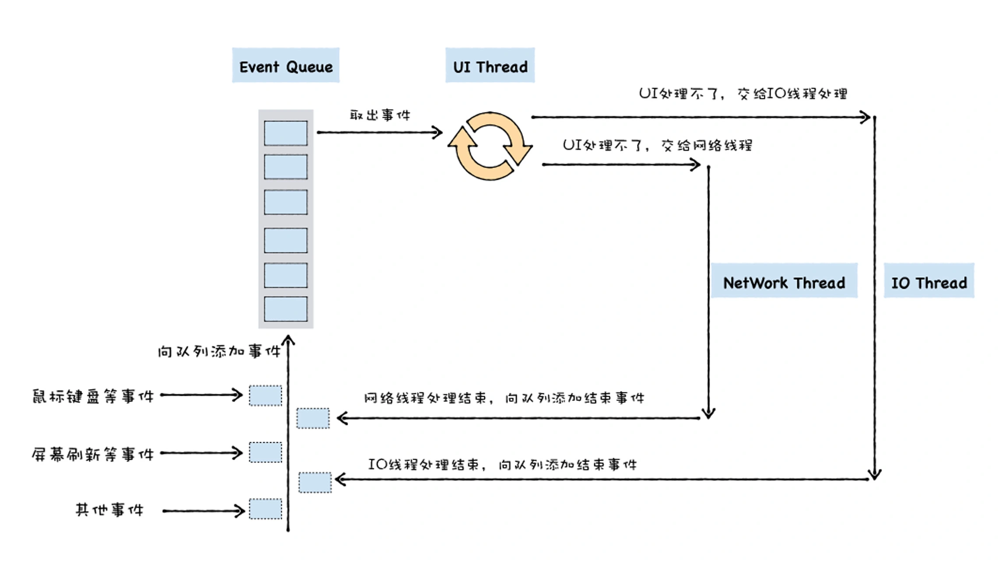

早期浏览器的页面是运行在一个单独的UI线程中，所以要在页面中引用javascript，那么javascript也必须要运行在和页面相同的线程上，这样才能方便使用js来操作DOM，所以从一开始，js就被设计成运行在UI线程中。

所谓UI线程，是指的运行窗口的线程，当你运行以运行一个窗口时，无论改页面是window上的窗口系统，还是android或者iOS的窗口系统，他们都需要处理各种事件，诸如触发绘制页面的事件，有鼠标点击，拖拽，放大缩小的事件，有资源下载，文件读写的事件。

在页面线程中，当以一个事件被触发时，比如用户使用鼠标点击了页面，系统需要将该事件提交给UI线程来处理

在大部分情况下，UI线程并不能立即响应和处理这些事件，比如在你移动鼠标的过程中，没移动一个像素都会产生一个事件，所以鼠标移动的事件会被频繁的触发，在这种情况下，页面线程可能正在处理前一个事件，那么最新的事件就无法被立即执行。

针对这种情况，我们为UI线程提供了一个消息队列，并将这些执行的事件添加到消息队列中，然后UI线程会不断循环的从消息队列中取出事件，执行事件，我们把UI线程每次从消息队列中取出事件，执行事件的过程称为一个任务。



```jsx
function UIMainThred(){
	while(queue.waitForMessage){
		Task task = queue.getNext();
		processNextMessage(task);	
	}
}
```

在这段代码中，queue是消息队列，queue.watiForMessage()会同步等等待消息队列中的消息到达，如果当前没有任何消息等待被处理，则这个函数会将UI线程挂起。如果消息队列中有消息，则使用queue.getNext()取出下一个要执行的消息，并交给processNextMessage函数来处理消息。

这就是通用的UI线程的结构，有消息队列，通过鼠标，键盘，触控板等缠身给的消息都会被添加到消息队列中，主线程循环的从消息队列中取出消息并且执行。

### 异步回调函数的调用机制


比如在页面主线程中正在执行A任务，在执行A任务的过程中调用setTimeout，在执行setTimeout函数的过程中，宿主就会将foo函数封装成一个事件并且添加到消息队列中，然后setTimeout函数执行结束。

主线程会不断的从消息队列中取出新的任务，执行新的任务，等待时机合适，取出setTimeout设置的foo函数的回调函数，然后就可以直接执行foo函数的调用了。

XMLHttpRequest是下载网络资源的，下载任务不适合放在主线程，因为下载任务通常耗时比较久，放在UI线程上执行，会阻塞UI线程，这会拖慢UI洁面的交互和绘制的效果。所以一般主线程从消息队列中去出这类的下载任务之后会分配给网络线程，让其在网络线程上执行下载过程，这样就不会影响到主线程的执行了。


## 微任务和宏任务

宏任务就是消息队列中的等待被主线程执行的事件。每个宏任务在执行时，V8都会重新创建栈，然后随着宏任务中函数调用，栈也随之变化，最终，当该宏任务执行结束时，整个栈又会被晴空，接着主线程继续执行下一个宏任务。

微任务可以看作是一个需要异步执行的函数，执行时机是在主函数执行结束之后，当前宏任务结束之前。

js引入微任务，主要是由于主线程消息队列中宏任务的事件颗粒度太大了，无法胜任一些精度和实施性要求比较高的场景，那么微任务可以在实时性和效率之间做一个有效的权衡。另外使用微任务，可以改变我们现在的异步编程模型，使得我们可以使用同步的形式的代码来编写异步调用。


### Node为什么能够处理高并发

Node并非真正意义上的单线程，它是主线程 单线程，通过事件驱动模型把I/O和计算进行分离。

它也有一个线程池（基于C/C++实现的libuv库）专门负责执行那些耗时较长的I/O任务，比如网络请求，文件读写等。任务执行完毕后会通知主线程。

而对于CPU计算形任务，都是由主线程完成的。

Node的重要优势就是把I/O 操作放在主线程之外，从而让主线程腾出手处理更多请求，因此Node擅长执行I/O密集型任务，不善于执行CPU密集任务。


- Node Standard Library: 由js编写的nodejs的标准库，即API。
- Node Bindings：这一层包括了C/C++ Bindings胶水代码，向下封装了V8和Libuv接口，向上提供了基础API接口，是连接JS 和C++的桥梁
- V8: js的运行环境，它为JS提供了在非浏览器端运行的环境。
- Libuv: 是专门为NODE开发的一个封装库，提供了跨平台的异步I/O能力，负责node运行时的线程池调度。
- C-ares:提供了异步处理DNS相关的能力
- http_parser… ： 提供了包含http解析，SSL，数据压缩等其他功能。


1. V8引擎解析应用JS脚本代码
2. 通过NODE binding调用C
3. 执行到当前事件时候，会把请求放在调用堆栈处理
4. 堆栈中的任务I/O请求都会交给Libuv处理，它会维护一个线程池，里面是一些工作线程，请求会调用这些线程来完成任务，这些线程则调用底层的C或者C++库
5. 请求完成后，libuv会把结果返回事件队列中等待主线程执行。
6. 期间，主线程继续执行其他的任务。

Node事件驱动机制

因为NODE主线程是单线程模式，所以在遇到高并发或者I/O的情况的时候，需要利用事件驱动机制。


每个NODE进程只有一个主线程在执行程序代码，形成一个执行栈。

**除了主线程之外，还维护了一个事件队列，当用户的网络请求或其他I/O异步操作来到时，NODE会把它放在Event Queue之中，此时并不会执行它，代码也不会阻塞，会继续走下去，直到主线程代码执行完毕。**

主线程代码执行完毕后，通过event loop开始到event queue开头取出事件并对每个事件从线程池中分配一个线程去执行，直到事件队列中所有的任务都执行完毕。

当所有的事件执行完毕后，会通知主线程执行回调方法，线程归还给线程池。

因此NODE本质上的异步操作还是由线程池完成的，它将所有的阻塞操作都交给了内部的线程池去实现，本身只是负责不断的往返调度，从而实现异步非阻塞I/O，这便是NODE单线程和事件驱动的精髓了。

### Dart的单线程以及为何不阻塞UI线程

异步I/O + 事件循环。跟NODE其实是差不多的，都是主线程是单线程，所有的同步任务都会在主线程进行，但是遇到了异步任务 比如I/O的话，会通过基于事件循环机制 将任务交给线程池中的其他线程进行，只需要在最后主线程通过回调拿到异步任务的完成结果即可。

dart的事件循环机制 event loop


dart时间循环机制由一个消息循环和两个消息队列构成，其中，两个消息队列是指事件队列和微任务队列。该机制的原理是：

- 首先，dart程序从main函数开始运行，待main函数执行完毕后，event looper开始工作
- 然后event loop优先遍历执行微任务队列的所有事件，直到微任务队列为空。
- 接着event looper才遍历执行event队列中的所有事件，直到event队列唯恐。
- 最后 看情况退出循环。

dart本身微任务队列使用程度较少，通常都是使用event，而dart给event任务建立提供了一层封装，叫做future。