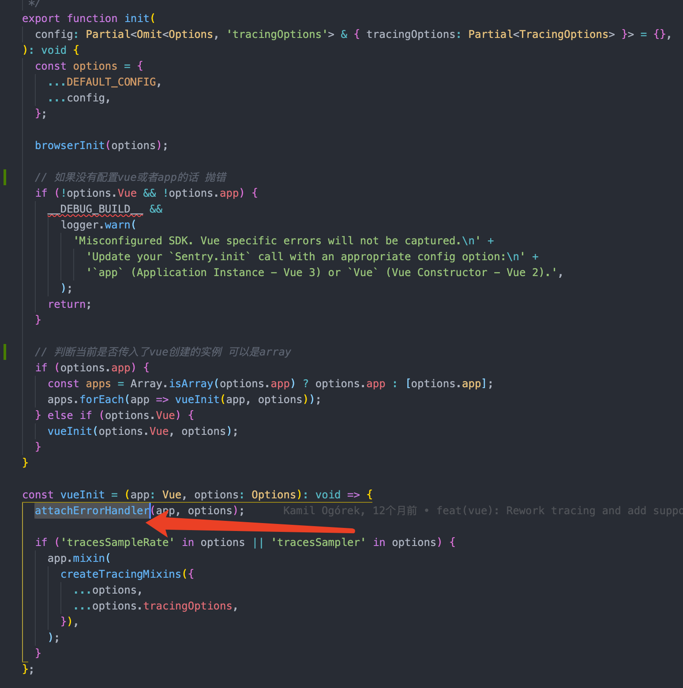
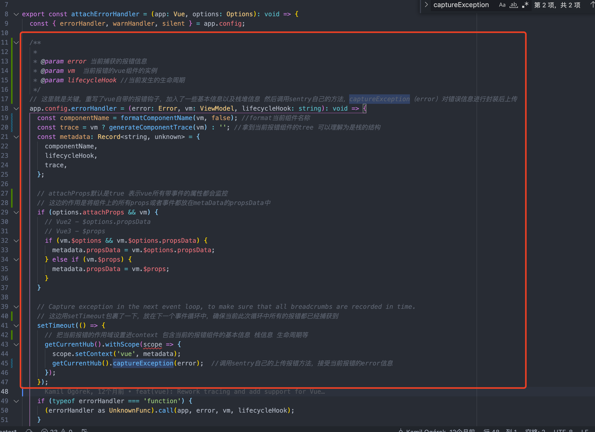

# 接入sentry以及sentry私有化部署

目前看来sentry私有化部署是需要使用docker-compose一键化安装，然后部署在服务器上，用nignx作为代理，将sentry请求的源进行代理，避免跨域问题。

sentry这边可以设置每次build上传sourceMap。便于后续线上报错可以定位到错误代码。

sentry这边可以设置webhook，进行issue实时提醒以及邮件提醒。

sentry这边私有化部署之后可以单点登录，接入极氪的sso。

sentry设置版本号，区别上线版本。

后续是否可以把sentry配置抽离成一个npm包，方便后续前端项目接入。

## why

1. 目前前端web这边没有线上监控报错机制，导致线上的错误没法快速反应，降低PV和UV。
2. 线上客户反馈错误后，基本上没法完美复现用户的错误，因为一些极端条件下的报错我们没法在本地模拟
3. 线上客户遇到BUG，很多用户的信息，比如该用户机型，IP，时间段，浏览器版本我们没法让用户去给我们传达这些信息，沟通成本高，降低解决效率
4. 对于H5页面，手机机型，网络情况，web版本这些测试同学没法将测试用例100%覆盖。

### why sentry

1. 支持私有化部署，也有saas版本，可以部署在自己的服务器上，避免数据泄漏，增加安全性以及稳定性
2. 支持soucemap文件上传，可以在前端捕获错误后上报的issue中精确定位到报错的源码
3. 用户各种基本信息都会一并上传到服务器，并且支持自定义上传报错信息，可塑性强
4. 基本支持目前市面上所有的语言，包括但不限于android ios flutter nodejs vue react js java…
5. 支持配置webhook，可以配置微信机器人，有issue第一时间反馈到对应的群里
6. 私有化部署后，所有的报错信息可以做一层bff，将数据上传到极氪自己的平台，方便后期统计。

### How

前端项目需要在入口进行配置。

```jsx
/** sentry初始化配置 */
Sentry.init({
  app,
  dsn: "项目的dsn地址",
  // environment: process.env.mode == "test" || "production", //当前部署环境
  integrations: [
    new BrowserTracing({
      routingInstrumentation: Sentry.vueRouterInstrumentation(router),
      tracingOrigins: ["localhost", "my-site-url.com", /^\//],
    }),
  ],
  // tracesSampleRate: 1.0,
});
```

release 版本号：如果没有版本号的控制的话那么，我们issues列表可能有很多不同线上发布的版本报错，那么无法精确到直到是哪个版本报错，所以这里我们需要进行手动控制版本号，这边尽量跟package.json里面的version挂钩。并且后续如果需要上传soucemap的话，也需要上传到对应版本号的soucemap文件里面。

soucemap：如果没有soucemap的话，那么sentry那边接收到的错误 并没有上下文代码信息，无法快速精确的找到当前报错代码。所以我们需要在打包的时候上传soucemap到sentry服务器那边（这边涉及到安全问题，所以最好还是私有化部署一下sentry，把map文件都上传到我们自己的服务器）。

soucemap上传在sentry这边有两种方式

- 结合sentry-cli手动上传，这种需要结合docker在部署阶段运行命令sentry cli —org…之类的，类似手动调API把map文件上传到sentry服务器上（又要说明一下安全问题），这种的话成本比较高
- 利用webpack或者rollup的插件，其实内部也是集成了sentry-cli，编写.sentryclirc配置文件，包括token，projectName，org，url。配置plugin，在打包期间，调用sentry-cli对map文件进行上传，好处就是流程都是自动的，并且会自动清理已经上传的map文件，build期间自动上传。

```jsx
rollupSentry({
      release: process.env.npm_package_version, //sentry project版本号
      include: [path.resolve(process.cwd(), "dist")], //当前soucemap包含的文件夹
      ignore: ["node_modules"], //不包含的文件夹
      deleteAfterCompile: true, // 当前soucemap上传成功后自动删除map文件
      configFile: path.resolve("./.sentryclirc"), //sentry cli上传需要的配置文件
      assetsPath: "build/asstes", // rollup打包路径
    }),
```

---

sentry实现方式看源码的话比较清晰，接受config，然后重写了Vue自带的捕获报错的钩子函数，并且对报错信息进行了一层封装，包含当前报错的组件实例，组件的trace以及当前组件接受的props以及其他相关信息。 这里只看封装的vue的sentry源码，其他的实现方式基本相似，react其实就是在componentDidCatch进行封装上传。



这里是关键


